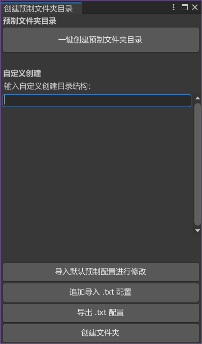
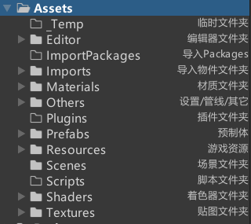

# UnityCreateFoldersInBulk

一个Unity批量创建文件夹的扩展编辑器

- 批量创建预制好的文件夹目录
- 可以自定义批量创建文件夹
- 支持导出/导出 .txt 配置文件

下载链接：[Download Unitypackage](https://github.com/MingMingZiX/UnityCreateFoldersInBulk/releases/download/0.9/CreaterFolder.unitypackage)

# 扩展编辑器界面

# 使用说明
### 一键创建预制文件夹目录
- 在Asset文件夹下创建预制好的文件夹目录 

### 导入默认预制配置进行修改
- 会在自定义创建目录文本输入框中导入默认的预制文件夹目录，可以根据这个参考进行修改
- 每个文件夹使用回车/换行隔开，例如：
Resources/GameObjects/Instances
Resources/GameObjects/LOD
Resources/GameObjects/Data

### 追加导入 .txt 配置
在文本输入框后追加从你的电脑导入的.txt文本内容

### 导出 .txt 配置
保存文本输入框中的内容到 .txt 文件，可以在别的工程中导入以快速创建文件夹

### 创建文件夹
- 对文本输入框中的内容按行读取目录创建文件夹。
- 使用的是相对路径，相对于Asset目录下创建文件夹